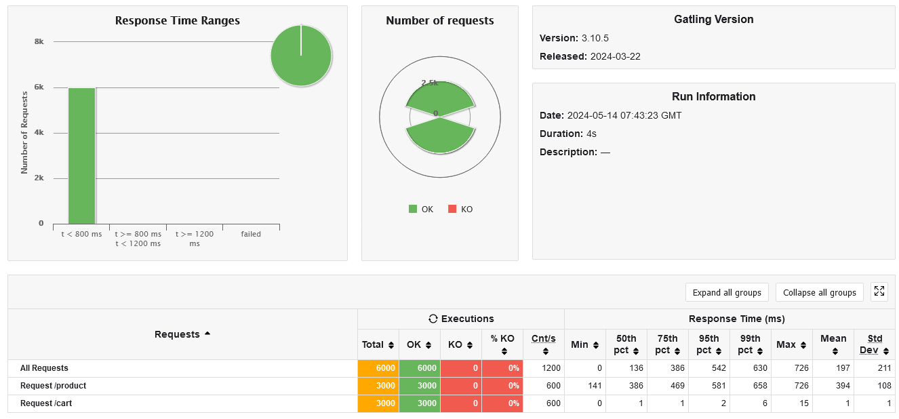
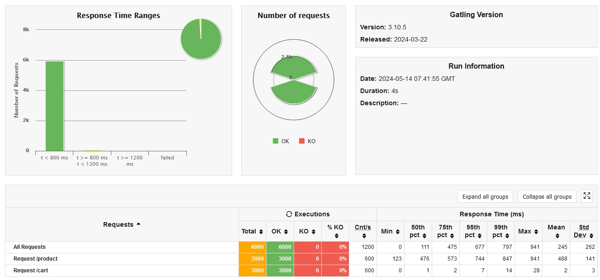

[](https://classroom.github.com/a/IMEm063v)
# Micro WebPoS 

## 实验报告

作业中一共有四个服务，分别为：
- 服务发现：负责微服务的注册
- 产品管理服务：负责提供商城中的产品列表及产品的详细信息
- 订单管理服务：负责管理用户的购物车，处理订单
- 网关：负责提供统一的入口，将请求转发给对应的微服务，并通过断路器等机制在一定程度过滤请求保护后端服务器

压力测试时令 2000 个用户同时访问网关的 `/product` 和 `/cart` 接口，限制产品管理服务和订单管理服务为 1 个实例，仅使用 1 个 CPU。测试结果如下：



为产品管理服务和订单管理服务各启动 3 个实例，每个实例依旧仅使用 1 个 CPU，测试结果如下：



可以看到，3 个实例的延迟表现甚至差于 1 个实例。通过查看测试时的 CPU 负载，发现 gatling 测试能够占用 800% 左右的 CPU 时间，我本地的实验机器上剩余的 CPU 核数不足以支持多个实例服务器同时运行，因此表现略差。在更强的 CPU 环境下，多个实例的性能表现应该会更好。

## 启动方式

```bash
docker compose up mysql discovery -d

sleep 15

docker compose up product-service -d

sleep 15

docker compose up ordering-service -d

sleep 15

docker compose up gateway -d
```

## 作业要求

请参考spring-petclinic-rest/spring-petclinic-microserivces 将webpos项目改为微服务架构，具体要求包括：
1. 至少包含独立的产品管理服务、订单管理服务以及discovery/gateway等微服务架构下需要的基础设施服务；
2. 请将系统内的不同微服务实现不同的计算复杂度，通过压力测试实验验证对单个微服务进行水平扩展（而无需整个系统所有服务都进行水平扩展）可以提升系统性能，请给出实验报告；
3. 请使用`RestTemplate`进行服务间访问，验证Client-side LB可行；
4. 请注意使用断路器等机制；
5. 如有兴趣可在kubernetes或者minikube上进行部署。

请编写readme对自己的系统和实验进行详细介绍。
